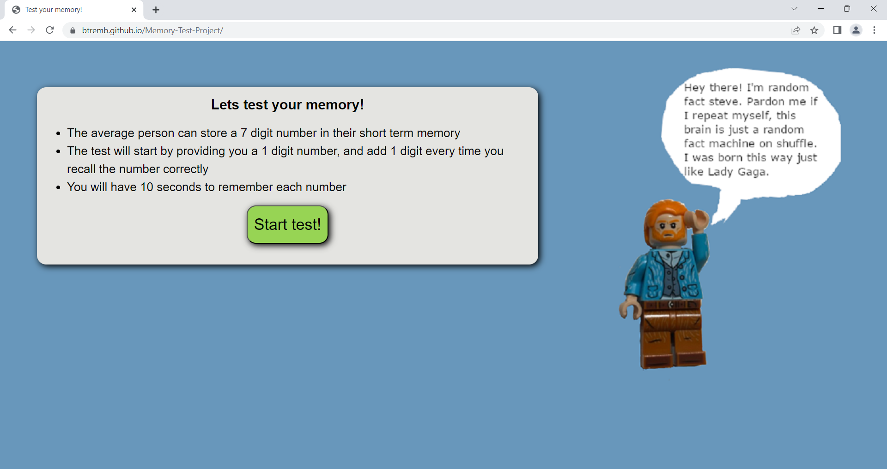

# Memory-Test-Project

## A fun game that tests your short term memory!

How it works:
* Starts by asking you to remember a 1 digit number, and asks you to recall the number on the next window
* If you recall the number correctly, you will advance to the next level (1 digit will be added every time you advance)
* You will have 10 seconds to remember each number, no matter the length!

Also, enjoy some random facts from lego Steve!

You can try it out at https://btremb.github.io/Memory-Test-Project/

